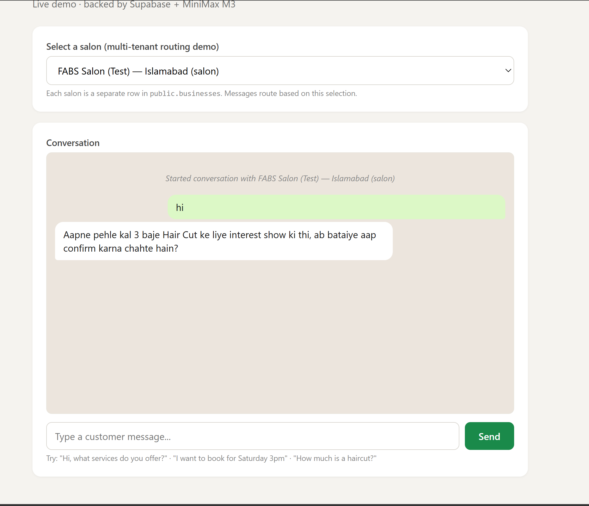
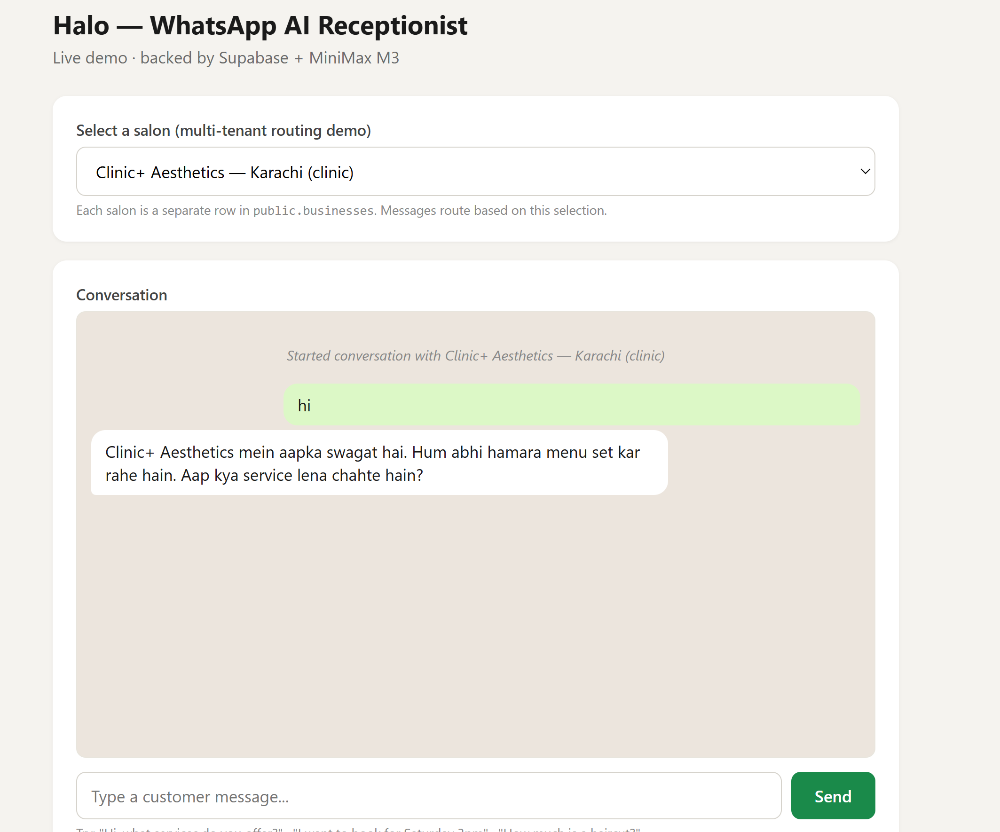
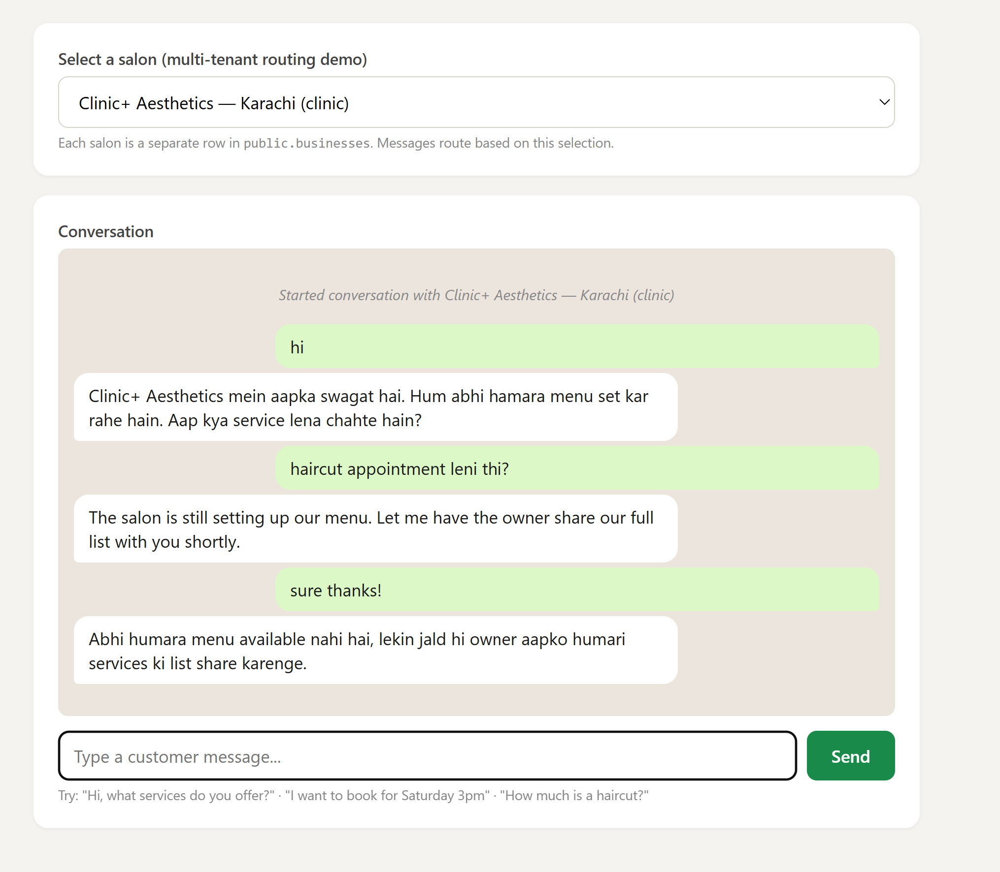
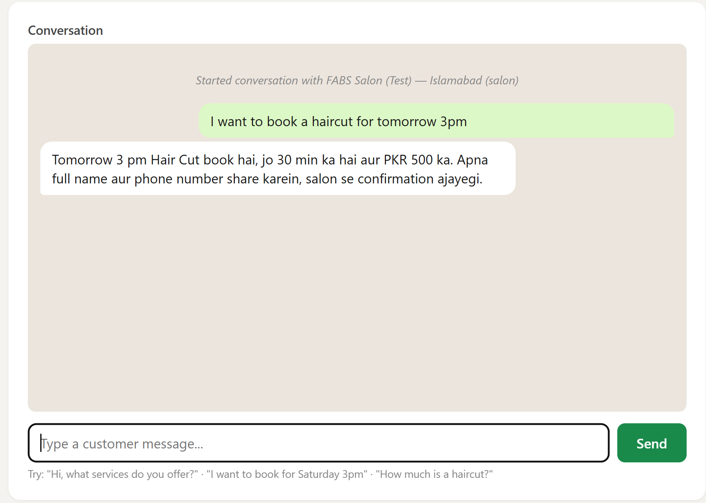
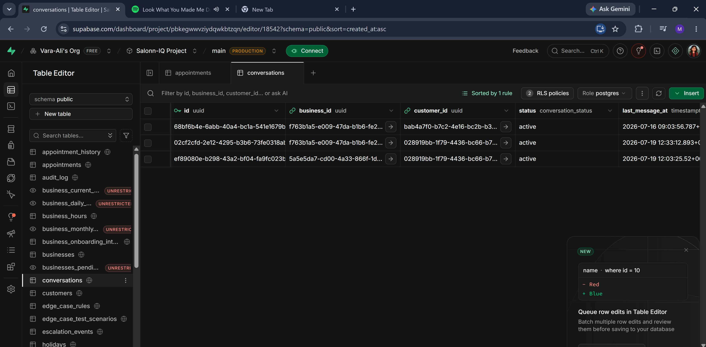
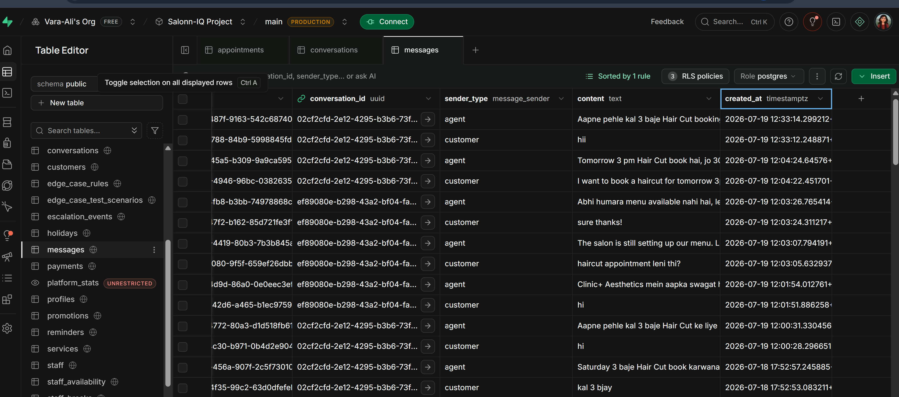
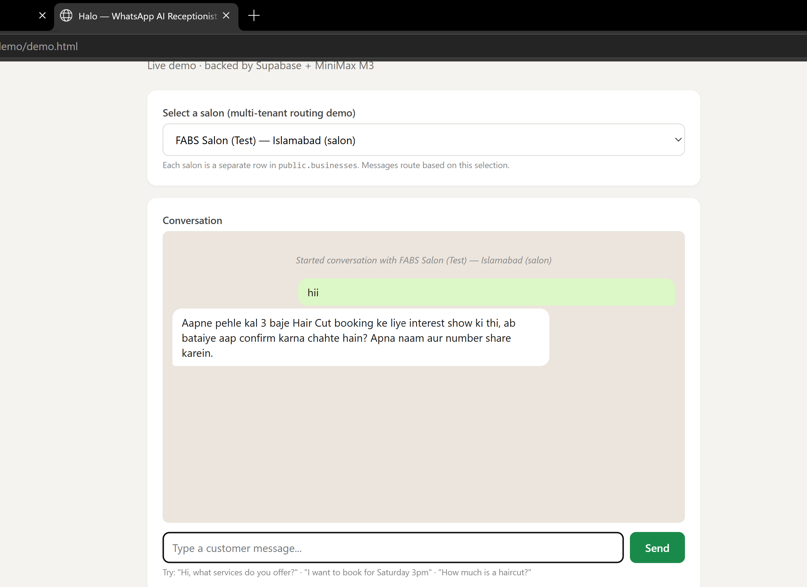

# SalonIQ — Week 4 Backend Demo Notes
**Squad Siachen · Comeback Pakistan Cohort 1**

This documents the backend/WhatsApp-integration work specifically, as actually built and
tested as of Week 4 via a live local run tonight — not just what's planned. Screenshots
below are real output from the running app, not mockups. Frontend work (superadmin panel,
landing page) is tracked separately.

---

## What's live end-to-end

- **Backend:** Node.js/Express, deployed target Vercel
- **Database:** Supabase (Postgres), full schema — `businesses`, `customers`,
  `conversations`, `messages`, `services`, `business_hours`, `staff`, `tier_limits`,
  `edge_case_rules`, `subscriptions`, `payments`, plus superadmin onboarding-review views.
  *Built in Week 3 — this week's work is the backend built and tested against it.*
- **LLM:** provider still being finalized — code defaults to MiniMax M3, tested locally
  tonight against Groq as a substitute (see note at end of this doc)
- **Routing:** multi-tenant, keyed by `businesses.phone_number_id` — each salon is one row,
  the same code path serves all of them
- **Demo interface:** `/demo/demo.html` — a plain HTTP chat widget that mirrors the real
  WhatsApp webhook flow, used for testing without depending on Meta's test mode

---

## Live demo walkthrough (tested tonight)

### 1. Multi-tenant routing — verified with two real salons
Same code, two different `businesses` rows, correctly isolated conversations and context.

**FABS Salon** — has seeded services, correctly recalls prior conversation history:

**Clinic+ Aesthetics** — a completely separate salon, fresh context, no bleed from FABS:

### 2. Graceful degradation for unconfigured salons
Clinic+ Aesthetics has no services loaded yet. Instead of inventing prices or availability,
the bot correctly says so and keeps the conversation coherent across turns:

### 3. Real data injection into replies
FABS Salon's reply below pulls the actual price (PKR 500) and duration (30 min) for
"Hair Cut" live from the `services` table — not hallucinated:

### 4. Database connection verified directly — not just inferred from replies
Rather than just trusting that a coherent reply implies a working DB connection, the
`conversations` and `messages` tables were checked directly in Supabase after testing:

**`conversations` table** — 3 rows, correctly split across two different `business_id`
values (FABS Salon vs. Clinic+ Aesthetics), confirming tenant isolation at the DB level,
not just in what the bot said back:

**`messages` table** — every message sent during testing shows up as a real row, correct
`sender_type` (`customer`/`agent`), matching timestamps and exact text:

**Fresh-session memory recall** — a brand new browser tab (not a continued session) still
correctly recalls a prior booking conversation. This confirms conversation memory is
genuinely persisted in Supabase, not just held in the page's local JS state while a tab
stays open:

--- — found via live testing tonight, not blockers, tracked as follow-ups

1. **Booking doesn't persist.** The conversation above ends with the bot implying a
   confirmed booking, but nothing is written to the `appointments` table. Verified directly
   against Supabase — the table stays empty after this exchange.
2. **Wording overclaims the booking.** The reply says the appointment "hai" (is booked,
   past tense) before even collecting the customer's name/phone, let alone before anything
   is saved. Needs a prompt-wording fix to stay conditional until a real confirmation exists.
3. **No real availability check.** The bot only checks whether a requested time falls
   within the salon's posted hours — it never calls `get_available_slots()` to check if a
   staff member is actually free, so it can't detect double-booking or offer alternate times.
4. **Platform safety rules aren't wired.** The 40 seeded `edge_case_rules` aren't queried
   anywhere; the medical-question decline works but only via static prompt text, not the
   real rules table. `escalation_events` stays at zero regardless of what should escalate.
5. **`getOrCreateConversation` has a theoretical race condition.** No DB-level uniqueness
   guard on active conversations yet — one-line partial unique index proposed, not applied.
6. **WhatsApp send credentials are global, not per-salon.** Fine while focused on one
   pilot salon; needs wiring to `businesses.phone_number_id`/`access_token` before a second
   real salon goes live.

None of the above blocked this week's merge — they're scoped as explicit follow-ups, not
silent gaps, and were found by actually running the app end-to-end rather than code review
alone.

---

## Week 4 Backend PR

- **#4 — Backend WhatsApp integration** (Vara-Ali): multi-tenant routing, race-safe
  customer/conversation creation, real per-salon context injection, graceful LLM/DB
  degradation. Approved with the six follow-up notes above.

*Frontend work (superadmin panel, landing page) is covered in a separate doc.*

---

## Stack confirmed working locally tonight

Node v24.18.0, Express, Supabase (ap-northeast-1) — full request → DB write → LLM reply →
DB write round trip tested live end-to-end.

**LLM provider is still being finalized.** Vara tested the integration against MiniMax M3
(the code's default). Locally tonight, testing was done against Groq's API instead, as a
drop-in substitute for verifying the booking/escalation/race-condition behavior — the
provider choice itself doesn't affect those results. A final decision between MiniMax and
Groq (or another option) is still open and should be locked before this goes further.